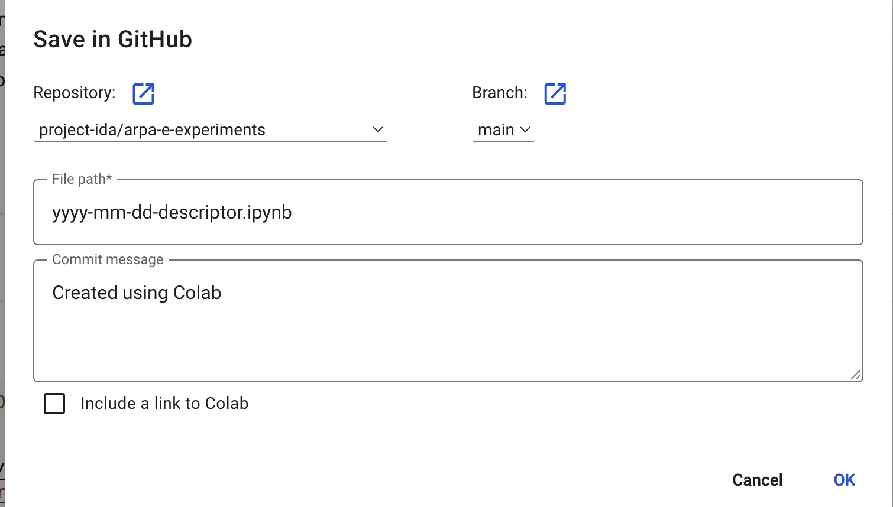

# Templates

There are 2 options for using the templates:

1. Working locally using **Jupyter Lab and Git**
2. Working remotely using **Google Colab**

### Local

1. Clone this repo
2. Make a copy of `yyyy-mm-dd-descriptor.ipynb` in the root of the repository (one level up from here)
3. Rename the new notebook in format yyyy-mm-dd-descriptor.ipynb
4. Follow the instructions included at the top of `yyyy-mm-dd-descriptor.ipynb`
5. Make your edits
6. Commit your changes and push when ready.

### Colab

1. Click on `yyyy-mm-dd-descriptor.ipynb` to open a read only version of the template
2. Click on the `Open in Colab` button that you'll see at the top of the notebook
3. Immediately save the notebook from within Colab (File -> Save)

- It will prompt you to sign into github and authorise Colab to save files to ProjectIda
- It will prompt you to save the notebook
- You must select the `arpa-e-experiments` repo and choose a new filename making sure to remove the `templates` bit of the file path so that the file ends up in the root of the repository
- It should look something like this 

4. Follow the instructions included at the top of `yyyy-mm-dd-descriptor.ipynb`
5. Make your edits
6. **Make sure to save your changes** so that the notebook is `committed` to the repo on Github
